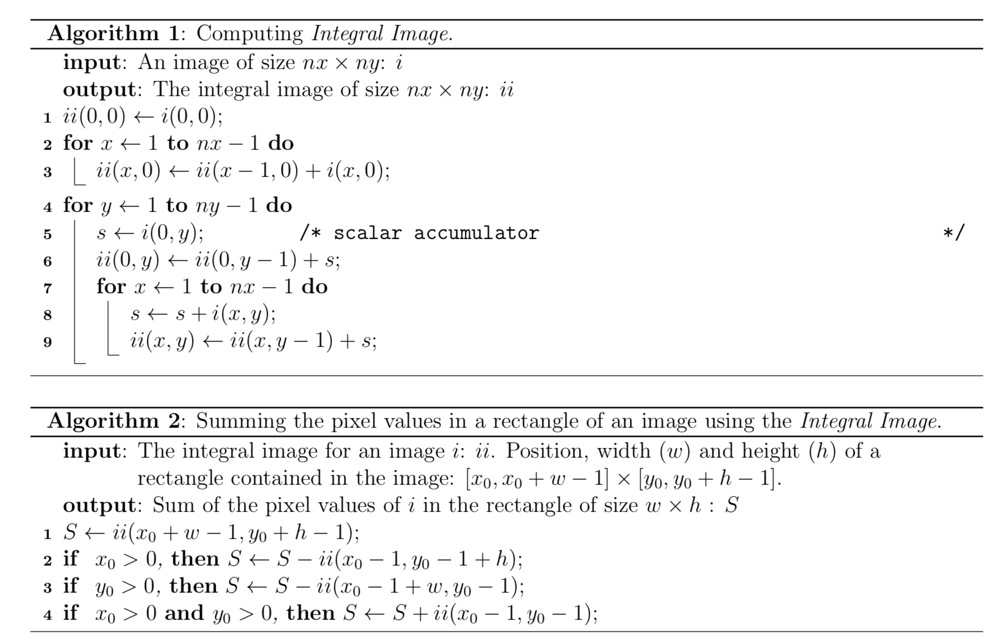

# Integral Image

## Overview

This is a test project where I implement a data structure “pixel sum” and algorithm that calculates integral image (or summed-area table) of the 8-bit (grayscale) image and calculates the sum of elements in a given search window.

There are two parts:

- Preprocess input image and calculate integral image.
- Find the sum of elements in a given search window using calculated integral image.



More info on integral images on [Wikipedia](https://en.wikipedia.org/wiki/Summed-area_table) and [Integral Images for Block Matching](https://www.ipol.im/pub/art/2014/57/article_lr.pdf) article.

**Goals of this Project:**

* Provide a C++ implementation of the class "PixelSum"
* The class should be able to provide efficient implementations of:
  * getPixelSum()
  * getPixelAverage()
  * getNonZeroCount()
  * getNonZeroAverage()
* Provide sufficient testing code
* The code should not crash or leak memory
* The algorithm chosen is O(1)
* Answer additional essay questions

## Results

I've implemented a PixelSum class with all necessary functions and provided some testing code.

In order to run tests
```
make
```
and run:
```
./testpixelsum
```

### Implemented Classes

All needed classes are in `src` directory.
- `Main.cpp` - runs tests
- `PixelSum.cpp` - main algorithm implementation
- `UnitTest.cpp` - atomic test for the algorithm; each unit test creates PixelSum object with data, runs all API of PixelSum, checks the result and prints the results.
- `Tests.cpp` - runs all tests; tests are combined into several groups; tests are:
  - one dimension buffers
  - horizontal, vertical, squared buffers
  - max buffers
  - different scan window size and positions
  - scan window out of bounds
  - copying and assigning

## Additional Essay Questions

**Typical buffers in our use cases are extremely sparse matrices, i.e., the vast majority of the pixels are zero. How would you exploit this to optimize the implementation?**

In case if our buffers contain a lot of zeros we can use [sparce matrices](https://en.wikipedia.org/wiki/Sparse_matrix) representation. One of the most popular format for storing sparce matrices is the compressed sparse row format (CSR). By doing so, memory required for data storage can be minimized.
We can use relative prefix sum (RPS) technique (some info [here](http://citeseerx.ist.psu.edu/viewdoc/download?doi=10.1.1.73.2474&rep=rep1&type=pdf) and [here](https://www.inf.unibz.it/~dignoes/res/adbis2017-slides.pdf)). In general, we divide source buffers into several sub-buffers and calculate sums for every sub-buffer. Total sum is calculated with the help of additional elements - anchor cells and overlay arrays. Also, it can be done in parallel.

**What changes to the code and the API need to be made if buffer dimensions can be >= 4096 x 4096? Also, what would happen if instead of 8 bits per pixel we have 16 bits per pixel?**

Currently our data structure can hold values up to 4096 * 4096 * 255 = 4 278 190 080. If buffer dimensions will be > 4096 x 4096 it is necessary to change the data type of our integral image. Current implementation uses `unsigned int`. Therefore, we'd have to use a wider data type (for ex. `unsigned long long int` with max 18 446 744 073 709 551 615). In case of 16 bits per pixel the idea would be the same - use wider data type (for ex. `unsigned short int` that can hold values up to 65535).

**What would change if we needed to find the maximum value inside the search window (instead of the sum or average)?**

Our arrays (search windows) are unsorted so that means in a naive case we must do a linear search O(n) to find the largest value. However, we can use the trick we've used to calculate integral image and do some preprocessing. We create lookup table using [Range Minimum Query (Sparse Table Algorithm)](https://www.geeksforgeeks.org/range-minimum-query-for-static-array/) technique (in our case use maximum instead of minimum) and after that we can achieve querying O(1) time complexity with O(n Log n) extra space and O(n Log n) preprocessing time.

**How would multi-threading change your implementation? What kinds of performance benefits would you expect?**

Multi-threading allows us to break a source buffer into sub-buffers and calculate integral image in parts, each part is calculated in a separate thread. We would expect some gain in preprocessing (calculating integral image) time.

**Outline shortly how the class would be implemented on a GPU (choose any relevant technology, e.g. CUDA, OpenCL).**

Let's choose CUDA. We can utilize the power of GPUs to do parallel computation (using thread blocks) of integral image. In a few words overall algorithm would be:
- take input buffer
- transfer buffer data fron CPU to GPU
- compute integral image
- transfer data back from GPU to CPU

Also, here are some articles that describe this process in details:
- [Efficient implementation of integrall image algorithm on NVIDIA CUDA](https://www.researchgate.net/publication/325770653_Efficient_implementation_of_integrall_image_algorithm_on_NVIDIA_CUDA)
- [Efficient Integral Image Computation on the GPU](https://dspace.mit.edu/bitstream/handle/1721.1/71883/Horn_Efficient%20integral.pdf?sequence=2&isAllowed=y)
